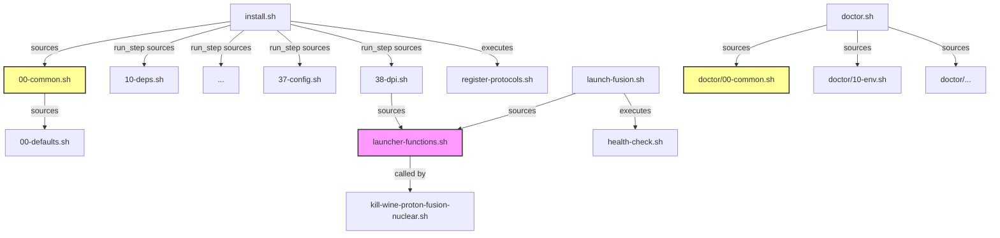

# Maintainability Review — Fusion360 Linux Installer

**Date:** 2026-07-28  
**Scope:** Full codebase (`src/install/`, `src/runtime/`, `src/bin/`, `src/doctor/`, root scripts)  
**Method:** Read-only analysis of code organization, duplication, function complexity, configuration management, error handling, and CI readiness.

---

## Summary

The codebase is a bash-first Linux installer + runtime for Autodesk Fusion 360 under GE-Proton/Wine, with a Python UI for configuration. It is functional and well-structured at the directory level, but has grown organically, creating several maintainability pain points. The 10 suggestions below target high-impact, low-effort improvements first.

---

## Suggestion 1: Extract shared color/output formatting to a single file

**What:** `src/install/00-common.sh` and `src/doctor/00-common.sh` both define identical ANSI color variables (~10 lines of `_C_RESET`, `_C_BOLD`, etc.) and similar output functions (`log_pass`/`pass`, `log_info`/`info`, `log_step`/`header`). Extract the color constants into a shared file (e.g., `src/shared/output-formatting.sh`) sourced by both.

**Where:** `src/install/00-common.sh`, `src/doctor/00-common.sh`, new `src/shared/output-formatting.sh`

**Impact:** Medium — Any color change must be made in two places today. A shared file eliminates the divergence risk and makes it trivial to add formatting to new scripts.

**Effort:** Easy — Move ~15 lines to a new file, source it in two places.

---

## Suggestion 2: Single source of truth for config keys

**What:** The set of config keys (PROTON, FUSION_WINE_DPI, FUSION_ENABLE_OVERLAY_KILLER, etc.) is duplicated across at least 5 locations:
- `src/bin/launch-fusion.sh` (lines 50-69): default values with `${VAR:-default}`
- `src/runtime/launcher-functions.sh::load_config()` (lines 24-40): post-source defaults
- `src/runtime/launcher-functions.sh::save_config()` (lines 47-56): key list for serialization
- `src/install/37-config.sh` (lines 17-38): CONFIG_KEYS and CONFIG_VALS arrays
- `src/runtime/launcher-config-user-interface.py` (lines 24-39): Python copy

When a new config key is added, 5 files must be updated in lockstep. Worse, `FUSION_OVERLAY_SIZE_TOLERANCE_PERCENT` appears in `save_config()` and `37-config.sh` but is missing from `load_config()`, meaning it has no default if absent from the config file.

**Recommendation:** Ship a single config schema file (e.g., `src/shared/config-keys.txt` or a bash associative array in `src/shared/config-defaults.sh`) that declares every key, its default, and a description. Have `launch-fusion.sh`, `load_config()`, `save_config()`, `37-config.sh`, and the Python UI all read from it. Python can parse the same text file.

**Where:** `src/bin/launch-fusion.sh`, `src/runtime/launcher-functions.sh`, `src/install/37-config.sh`, `src/runtime/launcher-config-user-interface.py`, new `src/shared/config-schema.sh`

**Impact:** High — Every config change requires 5-file coordination today. A single-schema approach removes entire classes of bugs (missing defaults, key drift between writers).

**Effort:** Medium — Requires designing the schema format and updating all consumers.

---

## Suggestion 3: Fix `load_config()` missing defaults for keys that `save_config()` writes

**What:** `save_config()` writes `FUSION_OVERLAY_SIZE_TOLERANCE_PERCENT` to disk, but `load_config()` does not set a default for it. If the config file is missing this key, the overlay killer will receive an empty string (which falls through to the default in the overlay killer script, but the gap is still a latent bug). Similarly, audit whether `load_config()` covers every key in `save_config()`.

**Where:** `src/runtime/launcher-functions.sh` — `load_config()` function

**Impact:** Medium — Currently masked by defaults in consumer scripts, but brittle.

**Effort:** Easy — Add the missing `:-` default line.

---

## Suggestion 4: Extract repetitive env-var export in `configure_with_file_browsers()`

**What:** `configure_with_file_browsers()` (lines 150-186 of `launcher-functions.sh`) exports 24 environment variables to the Python UI process. Each variable is listed twice: once in `configure_with_file_browsers()`, once in `apply_launch_environment()`. The list is nearly the same as the config keys from Suggestion 2. Use the shared config schema to generate these exports automatically via a loop, rather than maintaining a 24-line block of `VAR="$VAR" \` continuations.

**Where:** `src/runtime/launcher-functions.sh` — `configure_with_file_browsers()` and `apply_launch_environment()`

**Impact:** Medium — Adds a config key? Must also add it to this block. Easy to miss.

**Effort:** Medium — Depends on completing Suggestion 2 first. Once you have a key list, a `for` loop replaces the boilerplate.

---

## Suggestion 5: Split `apply_launch_environment()` into focused helpers

**What:** `apply_launch_environment()` is 90 lines long (lines 508-598) with 8 nearly identical `if is_enabled / export / else / unset` blocks, WebView2 argument assembly, DXVK_CONFIG string building, and Intel ICD detection. Each concern could be its own small function: `apply_dxvk_tuning()`, `apply_webview2_flags()`, `apply_intel_icd()`, `apply_toggle_flags()`. This makes the function self-documenting and testable in isolation.

**Where:** `src/runtime/launcher-functions.sh` — `apply_launch_environment()`

**Impact:** Medium — The current function works but is hard to scan. Splitting reduces the cognitive load of adding a new flag.

**Effort:** Medium — Refactor with care; each extracted function is straightforward.

---

## Suggestion 6: Deduplicate desktop entry creation

**What:** The `autodesk-fusion360.desktop` file is created in two places in `40-fusion-installer.sh` (around lines 14-29 and again at 182-195), and a similar `.desktop` file for the callback handler is created in both `launcher-functions.sh::install_callback_protocol_handlers()` (line 407-412) and `register-protocols.sh` (lines 9-17). Extract a shared `write_desktop_entry()` function that accepts name, exec, icon, and mime-type parameters.

**Where:** `src/install/40-fusion-installer.sh`, `src/runtime/launcher-functions.sh`, `src/runtime/register-protocols.sh`

**Impact:** Medium — Duplicate `.desktop` creation is a source of drift (different icons, different categories, different MIME types across the two copies).

**Effort:** Medium — Requires extracting the function and verifying both callers still produce identical output.

---

## Suggestion 7: DPI registry-writing logic is duplicated between install and runtime

**What:** `src/install/38-dpi.sh` calls `resolve_fusion_wine_dpi()` from `launcher-functions.sh` but then reimplements the registry-writing logic inline (LogPixels sed + printf for the Software\Wine\Fonts section). The launch-time `apply_fusion_wine_dpi()` in `launcher-functions.sh` does the same thing plus Win8DpiScaling. 38-dpi.sh should call `apply_fusion_wine_dpi()` directly (or a new `write_fusion_wine_dpi_registry()` function extracted from it), rather than partially reimplementing it. Also note that 38-dpi.sh uses different defaults (DPI=144) than launcher-functions.sh (DPI=auto).

**Where:** `src/install/38-dpi.sh`, `src/runtime/launcher-functions.sh`

**Impact:** Medium — Fixes to the registry-writing logic (e.g., the sed atomicity fix from Suggestion 8) must be applied in two places.

**Effort:** Medium — Refactor `apply_fusion_wine_dpi()` to separate resolution from registry writing, then call the write function from 38-dpi.sh.

---

## Suggestion 8: Add a ShellCheck CI step

**What:** ShellCheck is a static analysis tool for shell scripts that catches unquoted variables, incorrect `[`/`[[` usage, missing error handling, and dozens of other issues. Adding a ShellCheck run as a pre-commit hook or CI step would catch regressions immediately. A `.shellcheckrc` file can suppress intentional patterns.

**Where:** New `.shellcheckrc` at repo root, new `.github/workflows/shellcheck.yml` (or equivalent), possibly a `make lint` target.

**Impact:** High — ShellCheck catches real bugs (unquoted expansions, incorrect test operators, `local` misuse) that are easy to introduce in bash. The codebase already has good practices; this makes them enforceable.

**Effort:** Easy — Install ShellCheck, run it once, fix/suppress existing warnings, add to CI. The initial triage of existing warnings is the main work (~30-60 minutes).

---

## Suggestion 9: Make `run_step()` use a subshell for install step isolation

**What:** `install.sh::run_step()` sources each install script with `source "$SCRIPT_DIR/src/install/$1"`. Sourced scripts can leak variables, change shell options (e.g., `set -f` in `10-deps.sh`), and use `return` which exits `run_step()` correctly but is fragile — if any script uses `exit` instead of `return`, the entire install terminates. Wrapping the source in a subshell `( source "$SCRIPT_DIR/src/install/$1" )` would isolate each step. The only variable that needs to propagate back is `exit`/`return` status, which subshells preserve via `$?`.

**Where:** `install.sh` — `run_step()` function

**Impact:** Medium — The current approach works but is one `exit` away from a partial install. Subshell isolation prevents side-effect leaks between steps.

**Effort:** Easy — Change `source` to `( source ... )`. Verify that no install step relies on modifying the parent shell's environment (they shouldn't — `00-common.sh` is sourced before `run_step()` is called).

---

## Suggestion 10: Consolidate `SCRIPT_DIR` computation

**What:** 5 files compute `SCRIPT_DIR` differently:
- `install.sh`: `$(cd "$(dirname "${BASH_SOURCE[0]}")" && pwd)` — repo root
- `src/install/00-common.sh`: `${SCRIPT_DIR:-$(cd "$(dirname "${BASH_SOURCE[0]}")/../.." && pwd)}` — repo root fallback
- `src/bin/launch-fusion.sh`: `$(cd "$(dirname "$(readlink -f "${BASH_SOURCE[0]}")")" && pwd)` — uses readlink
- `src/doctor/doctor.sh`: `$(cd "$(dirname "${BASH_SOURCE[0]}")" && pwd)` — doctor dir
- `src/runtime/kill-wine-proton-fusion-nuclear.sh`: same as doctor but runtime dir
- `src/runtime/register-protocols.sh`: goes up one extra level

The `readlink -f` usage in `launch-fusion.sh` is the most robust (resolves symlinks). Standardize on one `find_repo_root()` or `find_script_dir()` helper in a shared utility file.

**Where:** `src/bin/launch-fusion.sh`, `src/install/00-common.sh`, `src/doctor/doctor.sh`, `src/runtime/kill-wine-proton-fusion-nuclear.sh`, `src/runtime/register-protocols.sh`, new `src/shared/paths.sh`

**Impact:** Low — The current approach works, but the subtle differences (readlink vs no readlink, .. vs ../..) are footguns for anyone adding a new script.

**Effort:** Easy — Extract to a function, update all callers.

---

## Quick Wins (low effort, immediate value)

These are too small for full suggestions but worth doing:

| # | What | Where | Why |
|---|------|-------|-----|
| 11 | Fix duplicate `INT TERM` in trap | `install.sh:28` | `trap '...' EXIT INT TERM INT TERM` has INT TERM twice |
| 12 | `fail()` name collision | `launch-fusion.sh:27` vs `doctor/00-common.sh:46` | Two different `fail()` functions (one fatal, one non-fatal counter) — confusing when both files are read together |
| 13 | `set -f` leak in 10-deps.sh | `src/install/10-deps.sh:9-13` | `set -f` is set globally; if `return 1` fires before `set +f`, the glob-disable persists in the calling shell |
| 14 | 38-dpi.sh uses `local` outside function | `src/install/38-dpi.sh:27-30` | `local` outside a function is a no-op in some bash versions and a syntax error in others; these scripts are sourced |

---

## What's Working Well

- **Directory structure:** `src/install/`, `src/runtime/`, `src/bin/`, `src/doctor/` is clean and intuitive.
- **Numbered install steps:** The 00-45 pattern with `run_step()` is a clear, sequential workflow.
- **XDG compliance:** Paths use `${XDG_CONFIG_HOME:-$HOME/.config}` consistently.
- **Idempotent install:** Most steps check for existing artifacts before re-running.
- **`set -euo pipefail` coverage:** All standalone scripts (9/11 runtime scripts) have it. The two that don't (`launcher-functions.sh`, `health-check.sh`) are intentional — one is sourced-only, the other was recently fixed.
- **Background daemon pattern:** The browser listener, overlay killer, and toolwindow fixer all follow a consistent start/cleanup lifecycle.
- **Distro package lists:** Extracting package names to `src/install/distro/*.txt` files was a good decoupling.

---

## Architecture Diagram



**Key:** Pink = largest file (598 lines, `launcher-functions.sh`). Yellow = shared formatting duplication. The dependency graph shows that `launcher-functions.sh` is the most-connected node — changes there affect the most consumers.

---

## Priority Matrix

```
                    Low Effort              Medium Effort           High Effort
High Impact    ┌───────────────────────┬───────────────────────┬───────────────────┐
               │ S8: ShellCheck CI     │ S2: Config key schema │                   │
               │ S3: load_config fix   │                       │                   │
               ├───────────────────────┼───────────────────────┼───────────────────┤
Medium Impact  │ S1: Shared formatting │ S4: Env-var exports   │                   │
               │ S9: Subshell isolation│ S5: Split apply_env   │                   │
               │ S10: SCRIPT_DIR dedup │ S6: Desktop dedup     │                   │
               │                       │ S7: DPI dedup         │                   │
               ├───────────────────────┼───────────────────────┼───────────────────┤
Low Impact     │ Q11-Q14: Quick wins   │                       │                   │
               └───────────────────────┴───────────────────────┴───────────────────┘
```

**Recommended order:** S8 (ShellCheck) → S3 (load_config fix) → Q11-Q14 (quick wins) → S1 (shared formatting) → S9 (subshell) → S2 (config schema) → then the medium-effort items as needed.

